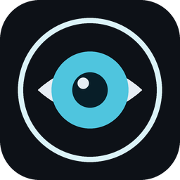
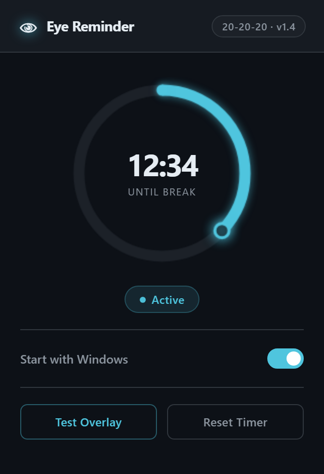
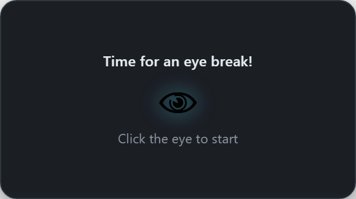

<p align="center">
  
</p>

<h1 align="center">Eye Reminder</h1>

<p align="center">
  A Windows tray app that enforces the 20-20-20 rule:<br>
  every 20 minutes of <em>actual screen time</em>, look at something 20 feet away for 20 seconds.
</p>

<p align="center">
  
  
  
</p>

<p align="center">
  
  &nbsp;&nbsp;
  
</p>

## Why it's not just another timer

Most break reminders count wall-clock time, so they interrupt you 5 minutes after you get back from lunch. Eye Reminder counts **active use only**: it polls the system idle time every second and pauses itself whenever you've been away from the keyboard and mouse for 60 seconds. Twenty minutes on the ring means twenty minutes of actual strain on your eyes.

When time is up, a small frameless card slides into the top-right corner. Clicking the glowing eye starts a 20-second countdown with a progress bar, then the card dismisses itself. Closing the card early still resets the work timer, so it never nags twice for one break.

## Features

- **Idle-aware timer** — pauses after 60 s of no input (`powerMonitor.getSystemIdleTime()`), resumes when you're back
- **Canvas countdown ring** — teal arc fills clockwise with a glowing dot tracking the tip, redrawn from live state every second
- **Break overlay** — transparent always-on-top card, opt-in countdown so a break never starts while you're mid-thought
- **System tray** — closing the window hides it; the app lives in the tray with test/reset/quit controls
- **Single instance** — launching a second copy just focuses the existing window
- **Start with Windows** — one toggle in the UI, wired to the OS login items
- **Dark UI** — GitHub-dark palette, 320x490 fixed window, staggered entry animations

## Install / Run

```bash
git clone https://github.com/danieledel288-code/eye-reminder.git
cd eye-reminder
npm install
npm start
```

Build a Windows installer (NSIS, outputs to `dist/`):

```bash
npm run build
```

## How it's put together

| File | Role |
|---|---|
| `main.js` | Electron main process: 1 Hz timer loop, idle detection, tray, overlay lifecycle, IPC, auto-start |
| `ui.html` | Main window: canvas ring renderer, status chip, settings, all inline (no framework) |
| `overlay.html` | Break card: eye button, 20 s countdown, progress bar |
| `preload.js` | `contextBridge` exposing a minimal `eyeApi` (context isolation on, node integration off) |

The renderer holds no timer state. It polls `get-status` over IPC once a second and draws whatever the main process reports, so the UI can never drift from reality and reopening the window always shows the true remaining time.

### Why the ring is a `<canvas>`

The ring went through SVG `stroke-dashoffset`, animated `<path>` arcs, and CSS transforms first. Each had a failure mode in Electron's renderer: the tracking dot stuck at 12 o'clock, both arc endpoints interpolating during transitions, wrong rotation origins on `<g>` elements. Plain Canvas 2D arcs made all of it deterministic: one `arc()` call for the track, one for the progress, `cos`/`sin` for the dot position. If you're fighting SVG ring animations in Electron, this is your sign.

## License

MIT
